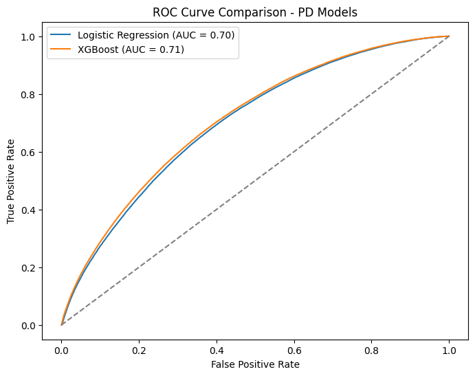
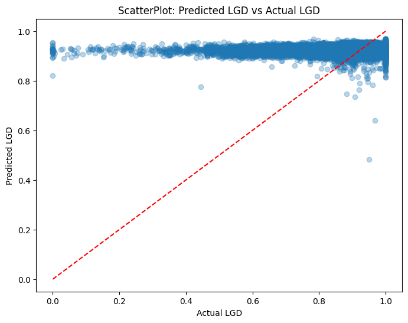
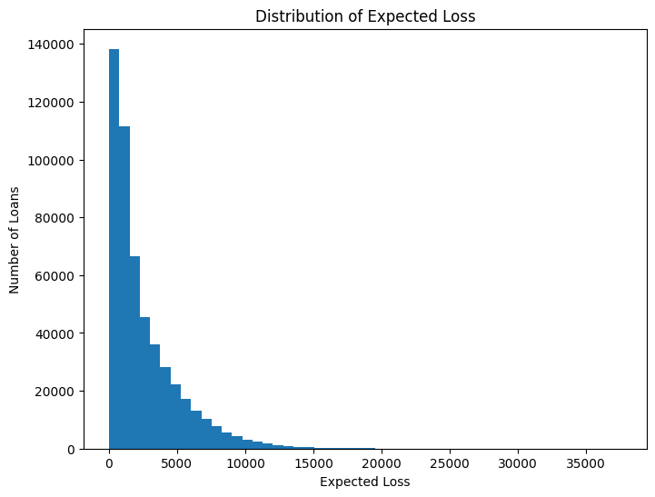
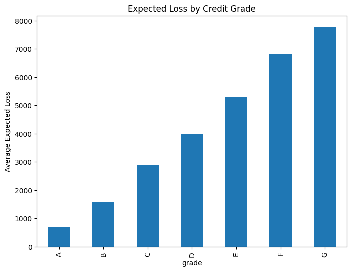
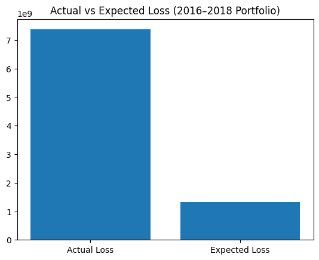
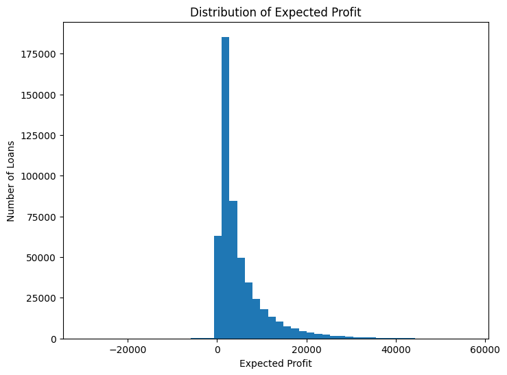
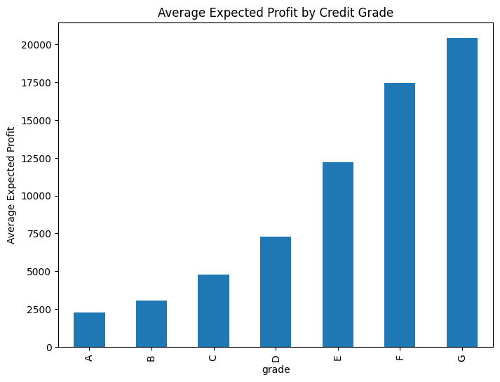
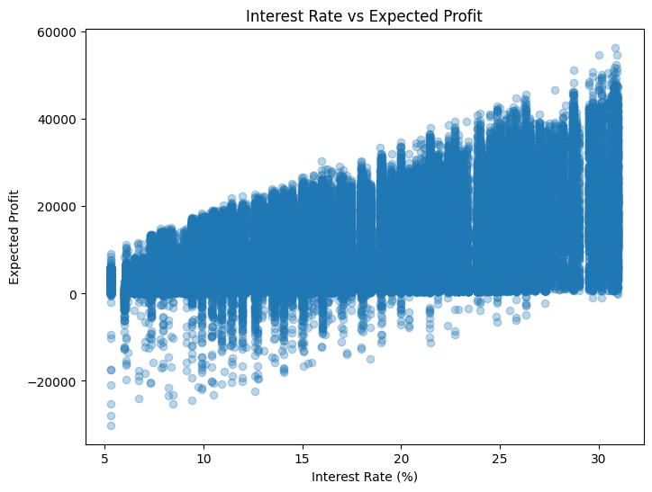

# Credit Risk Modelling & Risk-Based Pricing using LendingClub Loan Data

This project builds a **complete credit risk modelling pipeline** using LendingClub loan data.  
The objective is to simulate how lenders evaluate borrower risk and determine whether loan pricing sufficiently compensates for potential credit losses.

i.e. To build a credit risk modelling pipeline for unsecured consumer loans and evaluate portfolio risk and profitability using PD, LGD, Expected Loss, and Risk-
Based Pricing.

The analysis combines machine learning and financial risk modelling to estimate:

• **Probability of Default (PD)**  
• **Loss Given Default (LGD)**  
• **Expected Loss (EL)**  
• **Risk-Based Pricing & Portfolio Profitability**

The project ultimately evaluates whether a lending portfolio generates enough interest income to offset expected credit losses.

---

# Dataset

Source: **LendingClub Loan Data (2007–2018)**  

The dataset contains detailed loan-level information including:

- Loan amount and term
- Borrower income and employment
- Credit grades assigned by LendingClub
- Interest rates
- Repayment outcomes and recoveries

Scale of analysis:

| Metric | Value |
|------|------|
Total loans analyzed | ~1.3 million |
Test portfolio analyzed | ~518,000 loans |
Time period evaluated | 2016–2018 |

---

# Project Workflow

The project follows a simplified version of the **credit risk modelling framework used in financial institutions**.

1. Data Cleaning & Exploratory Analysis
2. Feature Engineering
3. PD Modelling
   - Logistic Regression
   - XGBoost
4. LGD Modelling
   - Random Forest Regression
5. Expected Loss Estimation
6. Risk-Based Pricing Simulation

Each stage builds upon the previous one to simulate a realistic lending risk analytics pipeline.

---

# 1. Data Cleaning & Exploratory Analysis

The raw LendingClub dataset was cleaned and filtered to focus on **completed loans**, ensuring that loan outcomes were known.

Key preprocessing steps included:

- Handling missing values
- Converting financial variables to numeric formats
- Creating default labels from loan status
- Filtering loans with known repayment outcomes

This stage prepared the dataset for downstream modelling.

---

# 2. Feature Engineering

Several predictive features were constructed to better represent borrower financial conditions.

Examples include:

- **Loan-to-income ratio**
- **Revolving balance to income ratio**
- **Average FICO score**
- Borrower verification status
- LendingClub credit grade

Categorical variables were encoded using **one-hot encoding** to prepare them for machine learning models.

---

# 3. Probability of Default (PD) Modelling

The first modelling stage estimates the **probability that a borrower will default on a loan**.

Two models were trained and compared:

- Logistic Regression (baseline credit scoring model)
- XGBoost (machine learning model)

Model performance was evaluated using **ROC-AUC**.

The logistic regression model achieved an ROC-AUC of approximately **0.70**, which is typical for consumer credit risk models.

---

# 4. Loss Given Default (LGD) Modelling

Loss Given Default measures **how much money is lost when a borrower defaults**.

Only loans that actually defaulted were used for LGD modelling.

A **Random Forest regression model** was trained to estimate loss severity.

The LGD model achieved an RMSE of approximately **0.094**, indicating reasonable predictive accuracy given the inherent variability of recovery outcomes.

---

# 5. Expected Loss Estimation

Expected Loss represents the **average credit loss anticipated for each loan**.

The calculation combines the three core components of credit risk:

EL = PD × LGD × EAD

Where:

- **PD** = Probability of Default  
- **LGD** = Loss Given Default  
- **EAD** = Exposure at Default (loan amount)

Portfolio-level expected losses were then analyzed.

Most loans carry relatively small expected losses, while a smaller number of riskier loans contribute disproportionately to portfolio risk.

---

# Expected Loss by Credit Grade

Borrowers with lower credit grades exhibit significantly higher expected losses.

This confirms that the LendingClub grading system effectively segments borrowers by risk level.

---

# Actual vs Expected Loss

To evaluate model calibration, expected losses were compared with realized portfolio losses.

While expected loss provides a forward-looking estimate of risk, realized losses may deviate due to borrower behaviour, economic conditions, and recovery uncertainty.

---

# 6. Risk-Based Pricing Simulation

The final stage evaluates **whether loan pricing compensates lenders for expected credit risk**.

Expected profit is calculated as:

Expected Profit = Interest Income − Expected Loss

Where interest income is approximated using the loan amount, interest rate, and loan term.

---

# Profit Distribution

Most loans generate positive expected profit, although some high-risk loans produce negative expected returns.

---

# Profit by Credit Grade

Higher-risk borrowers are charged higher interest rates, which can increase expected profit despite elevated default risk.

---

# Interest Rate vs Expected Profit

The relationship between interest rates and expected profit illustrates the principle of **risk-based pricing**, where lenders charge higher rates to compensate for higher credit risk.

---

# Key Model Results

PD Model ROC-AUC: ~0.70

LGD Model RMSE: ~0.094

Portfolio Expected Loss: ~$1.33B

Average Expected Loss per Loan: ~$2,565

# Key Insights

Key findings from the analysis include:

• Expected loss increases significantly across LendingClub credit grades  
• Lower credit grades (E–G) carry substantially higher credit risk  
• Risk-based pricing partially compensates lenders through higher interest rates  
• Some high-risk loans still generate negative expected profit despite higher pricing  

These insights illustrate the trade-off between **risk and profitability in lending portfolios**.

---

# Technologies Used

Python  
Pandas  
Scikit-learn  
XGBoost  
Matplotlib  

---

# Conclusion

This project demonstrates how **machine learning and financial risk modelling can be combined to analyze lending portfolios**.

By integrating PD, LGD, Expected Loss, and risk-based pricing analysis, the project simulates the type of **credit risk analytics used by lending institutions to evaluate borrower risk and portfolio profitability**.

